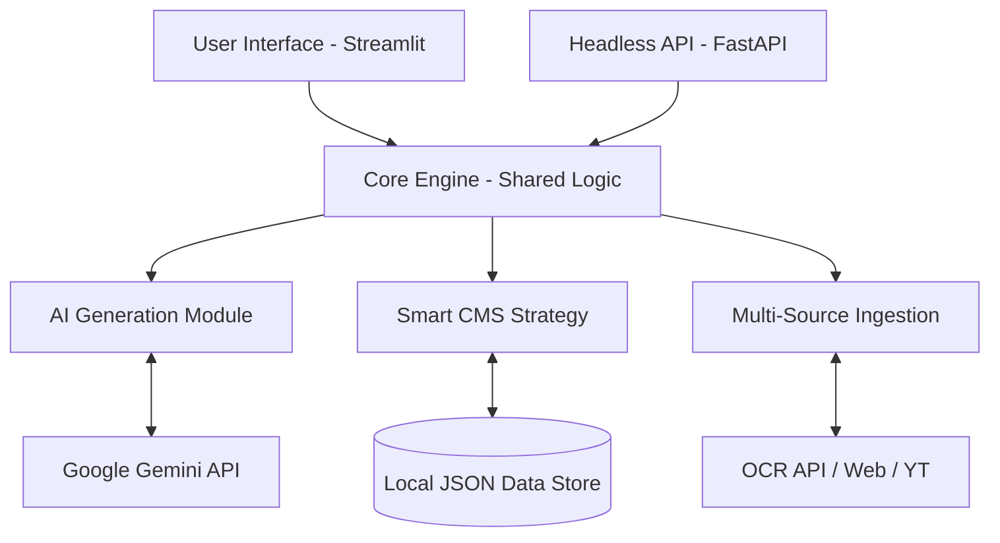

# 🏗️ Content OS v4.0: System Architecture & Design Specification

## 1. Project Overview
**Content OS** is an AI-native operational system designed for professional content creators, marketers, and developers. It serves as a centralized hub for content ideation, generation, transformation, and management, leveraging predictive AI models to optimize user engagement and branding consistency.

---

## 2. System Architecture
The system follows a **Decoupled Monolithic Architecture**, allowing for both a rich interactive UI (Streamlit) and a headless integration layer (FastAPI).

### 2.1 Technical Stack
| Layer | Technology |
| :--- | :--- |
| **Frontend UI** | Streamlit (Inter-based Premium Styling) |
| **Backend API** | FastAPI / Uvicorn |
| **Security** | JWT (JSON Web Tokens), BCrypt Hashing, OAuth2 |
| **AI LLM** | Google Gemini 1.5 Flash |
| **Persistence** | Local File System (JSON-wrapped Versioning & User DB) |
| **Ingestion** | BeautifulSoup4 (Web), PyPDF (Documents), YouTube Transcript API |

### 2.2 Visual Architecture Flow

---

## 3. Core Modules

### 3.1 AI Creation Engine
- **Multimodal Generation**: Supports Blog Posts, Social Media, Scripts, and Technical Docs.
- **Optimization Parameters**: Depth sliders (Basic to Expert), Tone selection (Casual to Academic), and Platform-specific formatting.
- **Advanced Features**: A/B Variant generation, Human-like rewriting, and Analogy-based explanation.

### 3.2 Global Content Management (Smart CMS)
- **Git-like Versioning**: Every save creates a unique hash `v_sha256.json`.
- **Atomic Metadata**: Projects store word counts, read times, and AI generation parameters in `meta.json`.
- **Project History**: Maintains a linear history allowing for version comparisons and rollbacks.

### 3.3 Personalization & Predictive Engine
- **User Behavior Modeling**: Analyzes session intensity and satisfaction to suggest next actions.
- **Predictive Engagement**: Uses AI to forecast likes, comments, and reach BEFORE publication.
- **Dynamic Audience Insights**: Predicts demographics, interest topics, and sentiment drift.

### 3.4 Ingestion Client
- **OCR Integration**: Robust processing of images and PDFs via an external render-hosted endpoint.
- **Semantic Scraper**: Extracts meaningful content from URLs and YouTube transcripts for context-aware generation.

---

## 4. Security & Compliance
- **JWT Authentication**: All API endpoints and UI sections are protected by industry-standard JWT tokens.
- **Identity Management**: Local BCrypt hashing for password security + placeholders for Google/LinkedIn OAuth.
- **Key Isolation**: Environment variables are strictly ignored by Git and verified on app startup.
- **Input Hardening**: 50,000-character input clipping to prevent API abuse.
- **Output Sanitization**: Universal HTML escaping to prevent XSS attacks in CMS and AI result panels.

---

## 5. Future Roadmap: Advanced Features

### 5.1 RAG-Integrated Content Discovery
- **Technology**: ChromaDB or Pinecone integration.
- **Feature**: Enable "Chat with your CMS" to pull insights from hundreds of past projects to write new content that matches historical performance.

### 5.2 Content Recycling & Auto-Aging
- **Feature**: An AI-driven alert system that identifies high-performing content that hasn't been updated in 6 months and suggests "Remixing" it for current trends.

### 5.3 Multi-Channel Direct Publishing
- **Feature**: Direct API connectors for **LinkedIn**, **Twitter/X**, and **Medium**.
- **Capability**: Schedule posts and track *actual* vs. *predicted* engagement to retrain the local personalization model.

### 5.4 Collaboration Hub
- **Feature**: Webhook support for Slack/Discord notifications when content is moved to "Review" or "Approval" stages.
- **Capability**: Multi-user conflict resolution for shared local storage over LAN/VPN.

### 5.5 Multimedia Transformation
- **Feature**: Integration with DALL-E 3 or Stable Diffusion to automatically generate featured images for every blog post based on context analysis.

---
*Document Version: 1.0.1*  
*Last Updated: 2026-02-14*
